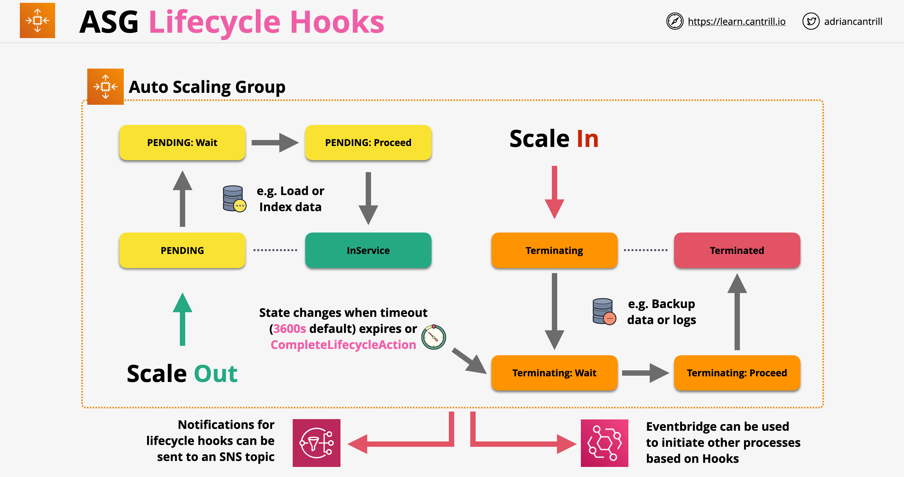

# ASG - Auto Scaling Groups

- Auto Scaling Groups provide auto scaling for EC2
- Provide the ability to implement a self-healing architecture
- ASGs make use of configurations defined in launch templates or launch configurations
- ASGs are using one version of a launch template/configuration
- ASG have 3 important values defined: *Minimum*, *Desired* and *Maximum* size
- ASG provides on foundational job: keeps the size of running instances at the desired size
- **Scaling Policies**: update the desired capacity based on some metric (CPU usage, number of connections, etc.)
    - They are essentially rules defined by us which can adjust the values of an ASG
    - Scaling types:
        - **Manual Scaling**
        - **Scheduled Scaling**: scheduling based on know time window
        - **Dynamic Scaling**
- Dynamic Scaling has 3 subtypes:
    - **Simple Scaling**: example "CPU above 50%  +1", "CPU Below 50% -1"
    - **Stepped Scaling**: scaling based on difference, allowing to react quicker
    - **Target Tracking**: example desired aggregate CPU = 40%. Not all metrics are supported by target tracking scaling
- **Cooldown Period**: a value in seconds, controls how long to wait after a scaling action happened before starting another action
- ASG monitor the health of instances, by default using the EC2 health checks
- ASG can integrate with load balancers: ASG can add/remove instances from a LB target group
- ASG can use the LB health checks in case of EC2 health checks

## Scaling Processes

- `Launch` and `Terminate`: if Launch is suspended, the ASG wont scale out / if Terminate is suspended the ASG wont scale in
- `AddToLoadBalancer`: add instance to LB
- `AlarmNotification`: control is the ASG reacts to CloudWatch alarms
- `AZRebalance`: balances instances evenly across all of AZs
- `HealthCheck`: controls if instance health checks are on/off
- `ReplaceUnhealthy`: controls if instances are replaced in case there are unhealthy
- `ScheduledActions`: controls if scheduled actions are on/off
- `Standby`: suspend any activities of ASG in a specific instance

## ASG Consideration

- ASG are free, we pay only for the instances provisioned
- We should use cool downs to avoid rapid scaling
- We should use smaller instances for granularity
- ASG integrates with ALBs
- ASG defines when and where, LT defines what

## ASG Lifecycle Hooks

- Allow to configure custom actions which can occur during ASG actions
- When an ASG scales out/in instances may pause within the flow to allow execution of lifecycle hooks
- We can specify a timeout for the lifecycle action, after the pause the system can decide if the ASG process continues or is abandoned
- We can resume the ASG process by calling `CompleteLifecycleAction`
- Lifecycle event hooks can be integrated with EventBridge, SQS or SNS

